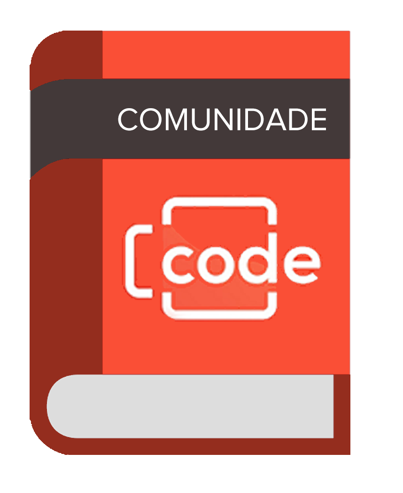
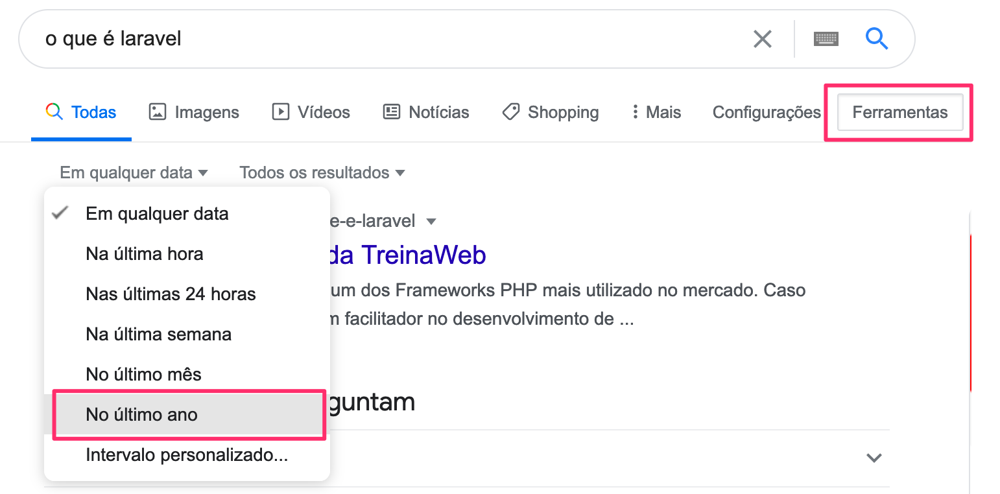
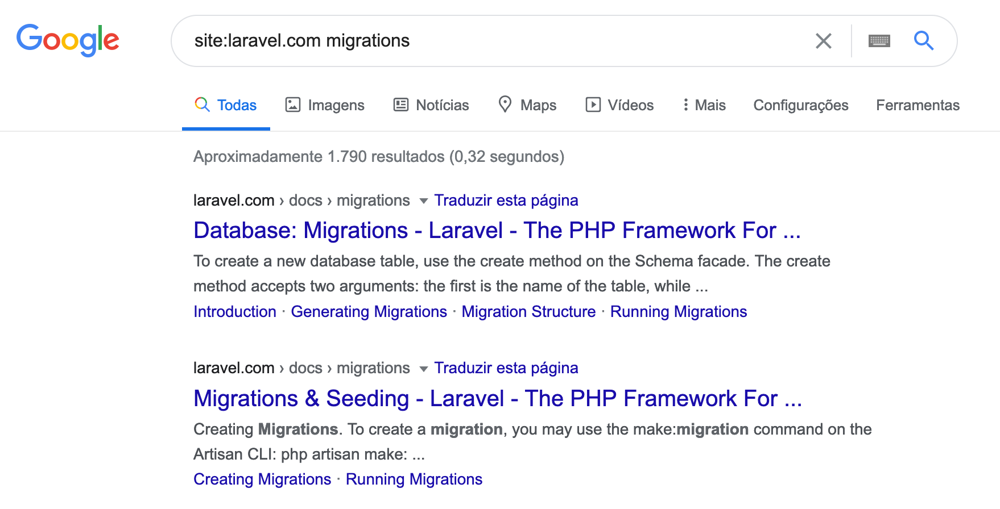
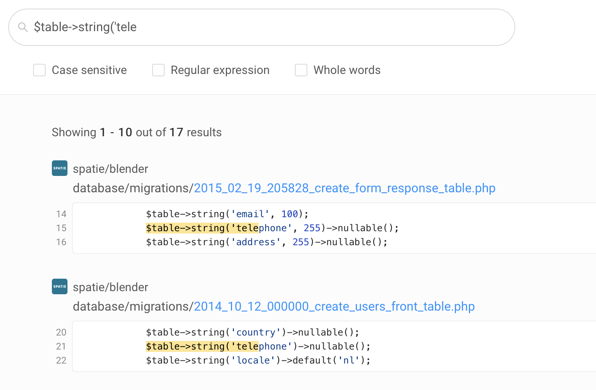

	

  
<h1>Guia da Comunidade Beer & Code</h1> 

Bem vindo(a) ao guia da  comunidade Beer & Code!!! 
O objetivo deste guia é garantir um bom ambiente de convivência e preservar a essência do Beer and Code, uma vez que estamos crescendo cada dia mais.

- [Motivações](#motivacoes)
- Termos de Uso
  + [Regras Gerais](#regras-gerais)
  + [Regras do Discord ](#phpstorm)
- [Moderadores](#ferramentas)
- Fazendo Boas Perguntas
  + [Introducao](#introducao)
  + [Antes de Perguntar](#antes-de-perguntar)
  + [Perguntando](#perguntando)
  + [Perguntei](#perguntei)

## Motivações
O Beer & Code nasceu quando o Danilo Sampaio e o Icaro Williams (Tio Jobs) conversavam sobre as dificuldades de preencher as vagas abertas na empresa onde trabalham e o Danilo contou que queria criar um canal no youtube com dicas e tutoriais para ajudar a treinar esses profissionais. O Tio Jobs topou na hora!  
Toda semana o Danilo, o Icaro e o Virgu produzem vídeos com conteúdo de tecnologia.   
Diariamente temos gente interagindo, trocando idéias e se ajudando mutuamente em nossas redes sociais.  
Todo o trabalho é voluntário e queremos continuar assim! Afinal, somos um grupo de pessoas apaixonados por tecnologia, PHP, Laravel (E cerveja! 🍻🍻🍻).  

## Termos de Uso
### Regras Gerais
 Esta são nossas regras gerais de boa convivência e são válidas em qualquer grupo do B&C - Youtube, WhatsApp, Telegram, Discord, etc. 

- <b>Seja fiel ao tema do grupo</b>: Nosso foco é tudo que está ligado a tecnologia, PHP, Laravel e suas Stacks. Você pode e deve dividir uma experiência, pedir conselhos, perguntar sobre uma dúvida, etc. Sempre que o assunto seja relacionado com os quais falamos.  Correntes, Brincadeiras, Trolagens, Hoax/Fake news não são permitidas. Política, futebol, religião e similares deixamos para outros grupos, ok?

- <b>Respeito e educação</b>: Não será tolerado qualquer tipo de discriminação ou linguagem ofensiva. Queremos construir uma comunidade segura para todas as pessoas crescerem e evoluírem no universo da tecnologia, qualquer uma dessas atitudes levará a exclusão imediata do autor e a denúncia as autoridades competentes.

- <b>Sem Flood!</b> Flood, ou seja, o envio massivo de mensagens não é permitido.

- <b>Siga as leis</b>: Não toleramos apologia a drogas, violência, bem como a divulgação de qualquer conteúdo ilegal como pornografia, programas e licenças piratas e links para malware ou phising.

- <b>Evite atritos</b>: Não compartilhe imagens com montagem ou conteúdo depreciativo sobre outras tecnologias e stacks. Além de não contribuir em nada, isso ainda pode confundir os menos experiêntes.

- <b>Links & Propaganda</b>: Se quiser divulgar algum projeto seu, proposta de trabalho, curso, live do youtube (etc.) PRIMEIRO entre em contato com a gente para aprovarmos. Nossa comunidade é muito importante pra nós e queremos manter sempre a qualidade do que é veiculado aos nossos membros 🙂

- <b>Conte conosco!</b> Se você estiver sofrendo qualquer tipo de assédio, estiver incomodado, por conta de atitudes de membros do grupo, entre em contato com os moderadores do Beer and Code. Nós estamos aqui para te ajudar!

### Regras do Discord
 Nossos canais no Discord são:

  + <b>Ausentes</b>: canal dos inativos, depois de 1h a pessoa é movida pra la automaticamente

  + <b>Lives</b>: a ideia é ter canais pra cada live, pra depois que acabar ou antes de começar trocar ideia
      + recados: chat de texto onde os admins vão colocar recados sobre as lives
      + saidera petiscando: chat de voz onde após desligar a live a gente pode entrar pra trocar ideia sobre, continuar o assunto

  + <b>Laboratório</b>: aqui é pra galera codar, produção de código 1000%
      + code room: uma sala geral de voz pra galera se juntar
      + code helper: sala mais reservada pra juntar um grupinho tirar duvidas e trabalhar junto num projeto, por exemplo.

  + <b>Buteco</b>: aqui é a parte que nois gosta
      + zap zap: chat por texto pra qm nao pode entrar no buteco por voz, pra trocar ideia mais descontraida mesmo
      + balcao: é a mesa geral do bar, onde cabe todo mundo
      + mesa: é pra juntar uma turma de 6 pessoas e passar a sexta a noite tomando uma e trocando ideia

  + <b>Lan house</b>: aqui é a gameplay de qualidade
      + chat: chat de texto pra enviar print do seu frag negativo no lolzinho
      + arquibancada: aqui é pra juntar a galera e assistir algum jogo junto e torcer pros time br
      + time: sao salas de 5 pessoas pra montar time e subir de patente.

  + <b>English</b>: Bora praticar Inglês 🇺🇸?
      + text-channel: This is THE PLACE to grab a beer and practice English!

### Moderadores
Os nossos moderadores advertirão o usuário em caso de não cumprimento das regras. Se o usuário não cessar a má conduta, isso resultará em explusão permanente do grupo.

# Fazendo Perguntas
## Introducão
Sabe aquele colega de escola que não faz nada e pede pra ter seu nome no trabalho. Isso é muito chato né? Ninguém gosta de gente preguiçosa e folgada! 
No mundo da tecnologia não é diferente. Todos nós investimos tempo, energia e dinheiro pra estudar tecnologias diferentes e se manter atualizado com as novidades. Também temos uma grande satisfação em ajudar aqueles que começam a trilhar um caminho o qual já trilhamos nós mesmos. Por isso, escrevemos esse pequeno guia para ajudar você a trilhar esse caminho com perguntas feitas da melhor forma possível.

### Antes de Perguntar
Antes de perguntar, siga esses passos:
+ <b>Leia a documentação!</b> - Você já foi ler a documentação, manual, exemplos ou FAQ. Muitas vezes a nossa dúvida já está explicada na documentação da Stack ou projeto.

+ <b>O google é seu amigo!</b> - Sempre pesquise sua dúvida, problema ou mensagem de erro no Google. Vale lembrar que existem parâmetros de configuração do Google que podem te ajudar a refinar seus resultados.  

  + Para buscar EXATAMENTE o texto que você precisa, basta coloca-lo entre aspas. Por exemplo: "General error: 1005 Can't create table". 

  + Para excluír palavras da busca, use o "-". Por exemplo, se você estiver no Windows e não quiser ver resultados relacionados ao Linux: "Instalar laravel" -Linux. 

  + Filtre por data: Isso fará com que você veja resultados mais recentes e provavelmente mais compatíveis com versão mais atualizada da stack que você usa.
  	 

  + Explore um site específico. Por exemplo:  "site:laravel.com migrations" vai pesquisar por "migrations" dentro de laravel.com
  	 

+ <b>Sua dúvida é código?</b> - Utilize-se de uma ferramenta como a [Grep.app](https://grep.app/) que busca em repositórios. Por exemplo, se sua dúvida é "como criar o campo telefone em uma migration", que tal ver como outros fizeram?
	 

Se a sua dúvida continua, é hora de perguntar!

### Perguntando

Uma boa pratica é preparar a sua questão. Escreva algumas vezes algum editor de texto antes de mandar. Escreva, Leia, re-escreva. Seja educado(a), direto(a) e objetivo(a).  
Não tente chamar atenção com mensagens em maísculo  
Mostre que você realizou todos os passos anteriores, que você fez sua lição de casa e que isso já lhe rendeu algum progresso.   
Lembre-se que quanto melhor for sua pergunta, mais chances ela terá de resposta.  

Veja dois exemplos de perguntas ruins: 
🚫
`
SOCORRO!!! a migration não funciona galera! dá erro! me ajudem?
`
  
🚫`
oi, cm faço 1 migration pra por idade no usuário? AJUDA AÊ POVO!!!!!!!! 
`

A primeira pergunta não provem nenhuma informação para que alguém possa entender o problema e começar a ajudar.  

A segunda pergunta passa a sensação que a pessoa é preguiçosa, não quis pesquisar e quer tudo servido de colher! Você se sente como se a pessoa não valoriza o SEU tempo. 

Agora, compare com essa maneira de perguntar:

✅`
Bom dia, quero adicionar idade na migration de usuário. Segui a documentação e o artisan criou o arquivo "add_age_to_users_table" dentro de database/migrations. O próximo passo é por $table->string('age') nesse arquivo? Alguém poderia me indicar um exemplo ou onde posso encontrar mais informações? Obrigado.  
`

Veja que neste outro exemplo, a pessoa demonstra que leu a documentação, que já está envolvida no processo e caminhando por sí mesma, porém precisa de uma forcinha. Ela não quer a resposta pronta ou que alguém faça o código por ela.

### Perguntei

Se você recebeu algumas respostas, ótimo! Lembre-se de agradecer a quem te ajudou. Um simples obrigado basta! Se lhe foi muito útil, considere perguntar no privado como você pode retribuir a ajuda. Às vezes, seguir quem te ajudou no twitter ou marcar uma estrela no repositório do github de algum projeto da pessoa já é um grande feito!

Agora, se ninguém te respondeu lembre-se que todos no grupo são voluntários. Ninguém está obrigado a responder sua pergunta. Não repita varias vezes a mesma pergunta (isso é flood) e muito menos seja hostil com a comunidade. Pode ser que todos estejam ocupados ou que ninguém saíba a resposta. Somos todos humanos!

          

Redes Sociais:
  
✔ Discord: https://discord.com/invite/mhyKFgv
 
✔ Twitter: https://twitter.com/beerandcodeyt/
​ 
✔ Instagram: https://www.instagram.com/beerandcode_oficial
 
✔ Facebook: https://www.facebook.com/beerandcodeoficial/
 
✔ Spotify: https://open.spotify.com/show/5xGXrAp97Ff9TZYgTYvdhL?si=TimdoZoOQvqzX7FeWHlT-A&nd=1
​ 
✔ Site: https://beerandcode.com.br/ 
 
✔ Linktree: https://linktr.ee/beerandcode​
 

Contato:
✉ contato@beerandcode.com.br

